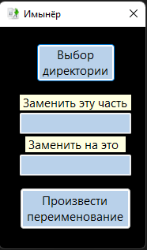

# Renamer
Утилита по массовому переименованию файлов.

## Как работать?

1) Выберите папку, где необходимо переименовать файлы.
2) Введите, какую часть в названии неообходимо заменить
3) Введите, новую часть названия файла, которая заменит старую
4) Нажмите кнопку "Произвести переименование"

P.S. Не рекомендуется изменять расширение с помощью данной утилиты.
